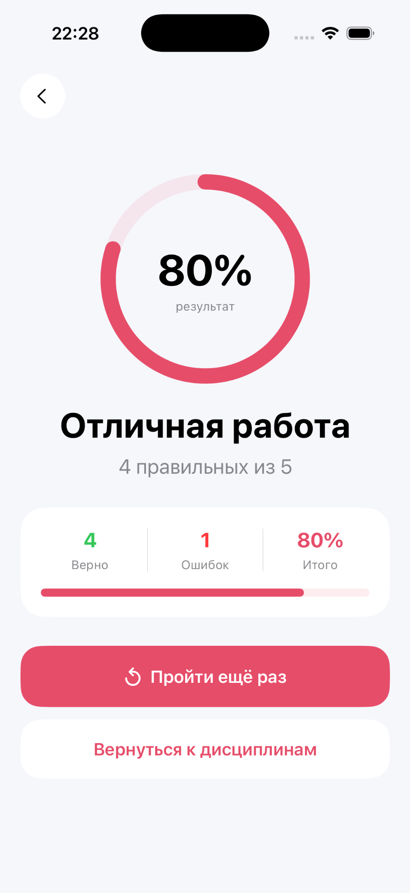

# MedQuiz iOS

MedQuiz is an educational iOS application for medical students built with SwiftUI.

The app helps students review medical topics through short multiple-choice quizzes with instant feedback and explanations.
## Screenshots

  
  
  
  

## Features

- Medical topic selection
- Multiple-choice questions
- Instant answer validation
- Correct and incorrect answer highlighting
- Short explanations after each answer
- Progress tracking
- Final quiz score
- Ability to restart the quiz

## Current topics

- Pathology

Planned:
- Cardiology
- Pharmacology

## Technologies

- Swift
- SwiftUI
- Xcode
- Git / GitHub

## What I learned

This is my first independent iOS learning project.

While building MedQuiz, I practiced:

- SwiftUI views and layouts
- NavigationStack and NavigationLink
- State management with @State
- Working with arrays and ForEach
- Creating reusable UI components
- Modeling quiz data
- Git commits and pushing a project to GitHub

## Development

I used AI tools as a learning and development assistant while working on the project.  
I worked through the application structure, interface logic, debugging and Git workflow step by step.

## Author

Dinara Mustafina  
Medical student exploring iOS development and digital health.
